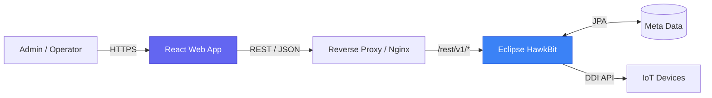
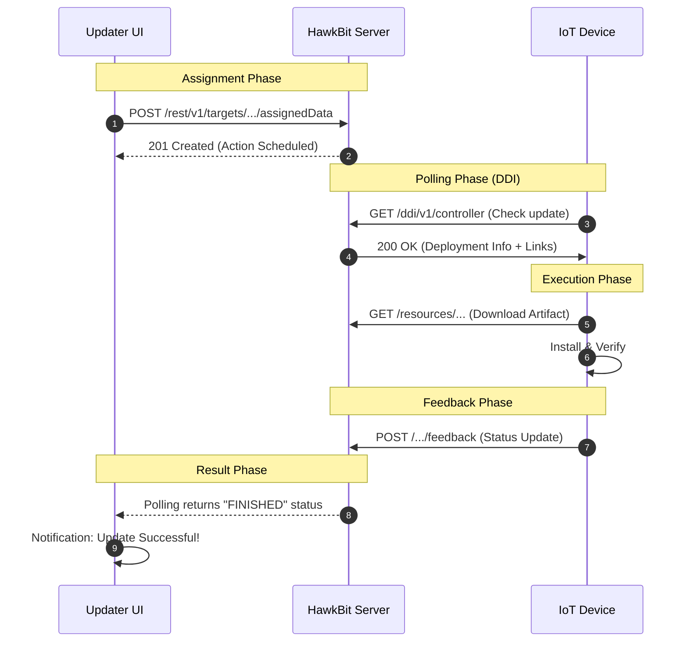

<div align="center">

# 🚀 HawkBit Updater UI

**Modern Management UI for Eclipse HawkBit**

[](https://github.com/rhkdguskim/hawkbit-updater-ui/actions/workflows/ci.yml)
[](https://github.com/rhkdguskim/hawkbit-updater-ui/actions/workflows/deploy.yml)
[](https://react.dev/)
[](https://www.typescriptlang.org/)
[](https://vitejs.dev/)
[](https://ant.design/)
[](LICENSE)

*A beautiful, operation-friendly web interface for managing large-scale IoT devices and software distributions.*

[Key Features](#-key-features) • [Installation](#-quick-start) • [Architecture](#-architecture) • [Deployment](#-deployment) • [Advanced Usage](#-advanced-usage)

</div>

---

## 📖 Overview

**HawkBit Updater UI** is a specialized, headless management frontend for [Eclipse HawkBit](https://www.eclipse.org/hawkbit/). Unlike the default HawkBit UI, this project focuses on **Operational Efficiency**, **Scalability**, and **Modern UX**.

### 💡 Core Philosophy
- **Headless First**: Communicates purely via the `/rest/v1` Management API. Zero backend modifications required.
- **Developer & Operator Friendly**: Combines deep technical monitoring with intuitive management workflows.
- **Enterprise Ready**: Designed to handle thousands of targets with advanced filtering and bulk actions.

---

## ✨ Key Features

### 📊 Intelligence Dashboard
- **Health Summary**: Instant view of target connectivity and update success rates.
- **Action Required**: Proactive detection of failed updates or overdue installations.
- **Live Trends**: Visual representation of deployment progress over time.

### 🎯 Pro Target Management
- **RSQL Power Search**: Filter targets using complex queries (e.g., `status==online;name=~*bot*`).
- **Bulk Operations**: Assign distribution sets, update tags, or delete multiple targets in one click.
- **Detailed History**: Full audit trail of actions per target with detailed status logs.

### 📦 Optimized Distribution Flow
- **Categorized Modules**: Organize software by types (OS, App, Config) with color-coded tags.
- **Versioning**: Clear overview of distribution set hierarchies and metadata.
- **Artifact Management**: Intuitive upload and metadata editing.

### 🚀 Industrial Rollouts
- **Smart Strategies**: Support for group-based deployments with pause/resume capabilities.
- **Threshold Control**: Automate rollout pauses based on error percentage thresholds.
- **Drill-down Analysis**: Identify exactly which targets failed in a massive rollout and why.

---

## 🏗 Architecture & Design

The Updater UI is designed as a **Single Page Application (SPA)** that sits on top of a standard HawkBit installation.

### 🛡️ Headless Integration


### 🔄 Real-time Strategy (Polling)
Since HawkBit Management API is REST-based without WebSocket support, we implement an optimized **polling strategy** using React Query:
- **Global Metrics**: Every 30 seconds.
- **Target List**: Every 10 seconds (when active).
- **Ongoing Actions**: Every 3 seconds to provide a "live" feel to deployments.

---

## 🔄 IoT Communication Flow

Understanding how a command from the UI reaches the device:



---

## 🛠 Tech Stack

| Component | Technology | Rationale |
| :--- | :--- | :--- |
| **Framework** | **React 19** | Standard-setting UI framework with the latest performance features. |
| **Language** | **TypeScript 5** | Strong typing for complex IoT domain models. |
| **Styling** | **Ant Design 6** | Premium, enterprise-grade component library. |
| **State** | **Zustand 5** | Lightweight client-side state management (Auth, Theme). |
| **Data Fetching** | **TanStack Query 5** | Robust caching, polling, and synchronization engine. |
| **Code Gen** | **Orval** | Automatic API hook generation from HawkBit OpenAPI. |

---

## 🚀 Quick Start

### 1. Prerequisites
- **Node.js** v18 or newer
- **npm** v9 or newer
- Access to a **HawkBit Server**

### 2. Local Setup
```bash
# Clone the project
git clone https://github.com/rhkdguskim/hawkbit-updater-ui.git
cd hawkbit-updater-ui

# Install dependencies
npm install

# Start the dev server
npm run dev
```

### 3. Environment Configuration
Create a `.env` in the root (see `.env_template`):
```env
VITE_APP_TITLE=Updater UI
VITE_LOGIN_TITLE=Management Console
# Base URL if not using proxy
VITE_API_BASE_URL=http://your-hawkbit-server:8080
```

---

## 🐳 Deployment

### Using Docker (Recommended)
The project includes a multi-stage Dockerfile for optimized builds.

```bash
# Build the image
docker build -t hawkbit-updater-ui .

# Run the container
docker run -p 80:80 -d hawkbit-updater-ui
```

### With Docker Compose
```yaml
version: '3.8'
services:
  updater-ui:
    image: rhkdguskim/hawkbit-updater-ui
    ports:
      - "80:80"
    environment:
      - HAWKBIT_URL=http://hawkbit:8080
```

---

## 🔍 Advanced Usage

### RSQL/FIQL Filtering
The UI leverages HawkBit's powerful search syntax. You can use it in search bars:
- `name==my-device*`: Devices starting with "my-device".
- `status==online;tags==beta`: Online devices with a "beta" tag.
- `lastContacted=lt=1672531200`: Devices contacted before a specific timestamp.

### API Code Generation
Whenever the HawkBit API spec changes, sync the client:
1. Update `docs/api-spec/management/openapi.json`.
2. Run `npm run gen:api`.
3. The hooks in `src/api/generated` will be updated automatically.

---

## � Project Structure
```bash
src/
├── api/              # API Infrastructure
│   ├── generated/    # Auto-generated React Query hooks (Do not edit)
│   └── axios-instance.ts
├── components/       # Primitive UI elements
├── features/         # Domain-driven modules
│   ├── dashboard/    # Analytics & Summary
│   ├── targets/      # Device management
│   ├── distributions/# Software assets
│   ├── rollouts/     # Deployment orchestration
│   └── auth/         # Login & Security
├── stores/           # Zustand state (Auth, Theme, I18n)
├── theme/            # Ant Design theme tokens (Dark/Light)
└── i18n/             # Translations (JSON based)
```

---

## 🤝 Contributing

We welcome your contributions!
1. **Fork** the repository.
2. Create a **Feature Branch** (`git checkout -b feature/cool-feature`).
3. **Commit** your changes (`git commit -m 'Add cool feature'`).
4. **Push** to the branch (`git push origin feature/cool-feature`).
5. Open a **Pull Request**.

---

## 📄 License
This project is licensed under the **MIT License**. See [LICENSE](LICENSE) for details.

<div align="center">

**Built for the IoT Ecosystem with ❤️**

[Report Bug](https://github.com/rhkdguskim/hawkbit-updater-ui/issues) • [Request Feature](https://github.com/rhkdguskim/hawkbit-updater-ui/issues)

</div>


