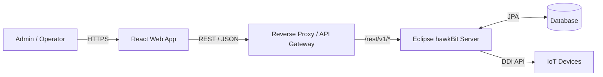

# 1. 개요 (Introduction)

## 1.1 목적 (Objective)

본 프로젝트의 주요 목표는 다음과 같다.

- **hawkBit 서버 수정 없이 그대로 사용** (Headless UI 방식)
- **Management API 기반의 운영 친화적 Web UI 제공**
- **대규모 Target/배포 운영 환경에 적합한 확장성·가독성·보안성 확보**

## 1.2 범위 (Scope)

| 구분 | 내용 |
| :--- | :--- |
| **Backend** | 기존 Eclipse hawkBit Server (Binary / Config 수정 없음) |
| **Frontend** | 신규 React 기반 SPA |
| **API** | hawkBit Management API (`/rest/v1`) |
| **제외** | hawkBit DDI(Device ↔ Server) API 직접 UI 제어 |

# 2. 시스템 아키텍처 (System Architecture)

## 2.1 전체 아키텍처 개요

본 시스템은 Headless hawkBit 아키텍처를 기반으로 하며, Frontend는 hawkBit와 직접 결합되지 않고 API 중심 통신만 수행한다.



## 2.2 통신 및 보안 전략

### Protocol
- HTTP/1.1 (REST)
- JSON / `application/hal+json` 지원

### 인증 전략

| 환경 | 방식 |
| :--- | :--- |
| **개발** | Vite Dev Proxy + Basic Auth Header 주입 |

### 권한 모델 (RBAC)
- hawkBit Management API 권한 기반 접근 제어 준수
- UI 레벨에서 메뉴/버튼/액션 권한 제어
- API 403 응답 시 사용자 친화적 안내 제공

### Query Language
- hawkBit 표준 FIQL(RSQL) 문법 사용

# 3. 기술 스택 (Technology Stack)

## 3.1 Core Stack

| 구분 | 기술 | 버전 | 선정 이유 |
| :--- | :--- | :--- | :--- |
| **Language** | TypeScript | 5.x+ | 복잡한 도메인 모델 타입 안정성 |
| **Framework** | React | 18.x+ | SPA 표준, 생태계, 장기 유지보수 |
| **Build Tool** | Vite | 5.x+ | 빠른 HMR, Proxy 설정 용이 |

## 3.2 상태 관리 & 데이터 패칭

| 구분 | 기술 | 용도 |
| :--- | :--- | :--- |
| **Server State** | TanStack Query | API 캐싱, Polling, Retry |
| **Client State** | Zustand | 로그인 정보, UI 상태 |

## 3.3 UI & UX

| 구분 | 기술 | 용도 |
| :--- | :--- | :--- |
| **UI Library** | Ant Design v5 | Admin UI 최적화 |
| **Styling** | Styled-components | 동적 테마 |
| **Icons** | React Icons | 아이콘 통합 |

## 3.4 API & Utilities

| 구분 | 기술 | 용도 |
| :--- | :--- | :--- |
| **HTTP Client** | Axios | Interceptor 기반 에러/인증 |
| **Code Gen** | Orval | hawkBit OpenAPI 기반 자동 생성 |
| **Date** | Day.js | 경량 날짜 처리 |

# 4. 프로젝트 구조 (Project Structure)

기능(Feature) 중심 구조를 채택한다.

```
src/
├── api/
│   ├── generated/          # Orval 자동 생성 코드
│   └── axios-instance.ts   # Interceptor, Base URL
├── components/             # 공통 UI 컴포넌트
├── features/
│   ├── auth/
│   ├── targets/
│   ├── distributions/
│   ├── rollouts/
│   └── actions/
├── hooks/
├── i18n/                   # 다국어 지원
│   ├── locales/
│   │   ├── ko/             # 한국어 번역
│   │   │   ├── common.json
│   │   │   ├── targets.json
│   │   │   └── ...
│   │   └── en/             # 영어 번역
│   │       ├── common.json
│   │       ├── targets.json
│   │       └── ...
│   └── index.ts            # i18n 설정
├── stores/
│   ├── useAuthStore.ts
│   ├── useThemeStore.ts    # 테마 상태 관리
│   └── useLanguageStore.ts # 언어 상태 관리
├── theme/                  # 테마 설정
│   ├── lightTheme.ts
│   ├── darkTheme.ts
│   └── index.ts
├── utils/
├── App.tsx
└── main.tsx
```

# 5. 다국어 지원 (Internationalization)

## 5.1 개요

애플리케이션은 한국어(ko)와 영어(en)를 기본 지원하며, 확장 가능한 i18n 아키텍처를 채택한다.

## 5.2 기술 스택

| 구분 | 기술 | 용도 |
| :--- | :--- | :--- |
| **i18n 라이브러리** | react-i18next | React 통합 다국어 처리 |
| **언어 감지** | i18next-browser-languagedetector | 브라우저 언어 자동 감지 |
| **상태 저장** | Zustand + LocalStorage | 사용자 언어 선택 유지 |

## 5.3 번역 구조

```typescript
// i18n/locales/ko/common.json
{
  "appName": "hawkBit 업데이터",
  "nav": {
    "dashboard": "대시보드",
    "targets": "타겟 관리",
    "distributions": "배포 세트",
    "rollouts": "롤아웃",
    "system": "시스템 설정"
  },
  "actions": {
    "save": "저장",
    "cancel": "취소",
    "delete": "삭제",
    "edit": "편집",
    "confirm": "확인"
  },
  "messages": {
    "success": "성공적으로 처리되었습니다.",
    "error": "오류가 발생했습니다.",
    "loading": "로딩 중..."
  }
}
```

## 5.4 사용 방법

```tsx
import { useTranslation } from 'react-i18next';

const Component: React.FC = () => {
  const { t } = useTranslation();
  
  return (
    <Button>{t('actions.save')}</Button>
  );
};
```

## 5.5 언어 전환 UI

- Header에 언어 선택 드롭다운 배치
- 선택 옵션: 🇰🇷 한국어 / 🇺🇸 English
- 변경 시 즉시 반영 (페이지 새로고침 불필요)

# 6. 테마 설정 (Theme Configuration)

## 6.1 개요

Light/Dark 모드 및 시스템 설정 자동 감지를 지원한다.

## 6.2 지원 테마

| 테마 | 설명 |
| :--- | :--- |
| **Light** | 밝은 배경의 기본 테마 |
| **Dark** | 어두운 배경의 다크 테마 |
| **System** | OS 설정에 따라 자동 전환 |

## 6.3 기술 스택

| 구분 | 기술 | 용도 |
| :--- | :--- | :--- |
| **테마 시스템** | Ant Design ConfigProvider | 컴포넌트 테마 적용 |
| **커스텀 토큰** | Ant Design Token | 색상, 폰트, 간격 커스터마이징 |
| **상태 관리** | Zustand + LocalStorage | 사용자 테마 선택 유지 |
| **시스템 감지** | matchMedia API | OS 다크모드 감지 |

## 6.4 테마 토큰 정의

```typescript
// theme/lightTheme.ts
import type { ThemeConfig } from 'antd';

export const lightTheme: ThemeConfig = {
  token: {
    colorPrimary: '#1890ff',
    colorBgContainer: '#ffffff',
    colorBgLayout: '#f0f2f5',
    colorText: '#000000e0',
    borderRadius: 8,
    fontFamily: "'Inter', -apple-system, BlinkMacSystemFont, 'Segoe UI', sans-serif",
  },
  algorithm: undefined, // Default light algorithm
};

// theme/darkTheme.ts
import { theme } from 'antd';
import type { ThemeConfig } from 'antd';

export const darkTheme: ThemeConfig = {
  token: {
    colorPrimary: '#177ddc',
    colorBgContainer: '#1f1f1f',
    colorBgLayout: '#141414',
    colorText: '#ffffffd9',
    borderRadius: 8,
    fontFamily: "'Inter', -apple-system, BlinkMacSystemFont, 'Segoe UI', sans-serif",
  },
  algorithm: theme.darkAlgorithm,
};
```

## 6.5 테마 상태 관리

```typescript
// stores/useThemeStore.ts
import { create } from 'zustand';
import { persist } from 'zustand/middleware';

type ThemeMode = 'light' | 'dark' | 'system';

interface ThemeState {
  mode: ThemeMode;
  setMode: (mode: ThemeMode) => void;
  resolvedTheme: 'light' | 'dark'; // 실제 적용된 테마
}
```

## 6.6 테마 전환 UI

- Header에 테마 토글 버튼/드롭다운 배치
- 아이콘: ☀️ Light / 🌙 Dark / 💻 System
- 변경 시 즉시 반영 (전환 애니메이션 포함)

# 7. 핵심 구현 전략 (Implementation Strategies)

## 7.1 RSQL(FIQL) Query Handling
- 모든 List 화면은 Server-side Filtering만 허용
- UI Filter State → RSQL 문자열 변환 빌더 구현

```javascript
// Example
{
  name: "bot",
  status: "online"
}
// → name=="bot";status=="online"
```

## 7.2 실시간 상태 갱신 (Polling)
- hawkBit는 WebSocket 미지원 → Polling 기반 상태 동기화

| 화면 | 주기 |
| :--- | :--- |
| **Target List** | 10초 |
| **Action 진행 중** | 3초 |
| **Rollout 상세** | 상태 변경 시만 활성 |

## 7.3 대용량 파일 업로드
- `multipart/form-data` 방식
- `Axios.onUploadProgress` 사용
- **UI 요구사항**:
  - 진행률 표시
  - 취소 / 실패 재시도

## 7.4 CORS & Proxy 설정 (개발 환경)

```typescript
// vite.config.ts
export default defineConfig({
  server: {
    proxy: {
      '/rest': {
        target: 'http://HAWKBIT_SERVER:HAWKBIT_SERVER_PORT',
        changeOrigin: true,
        secure: false,
      },
    },
  },
});
```